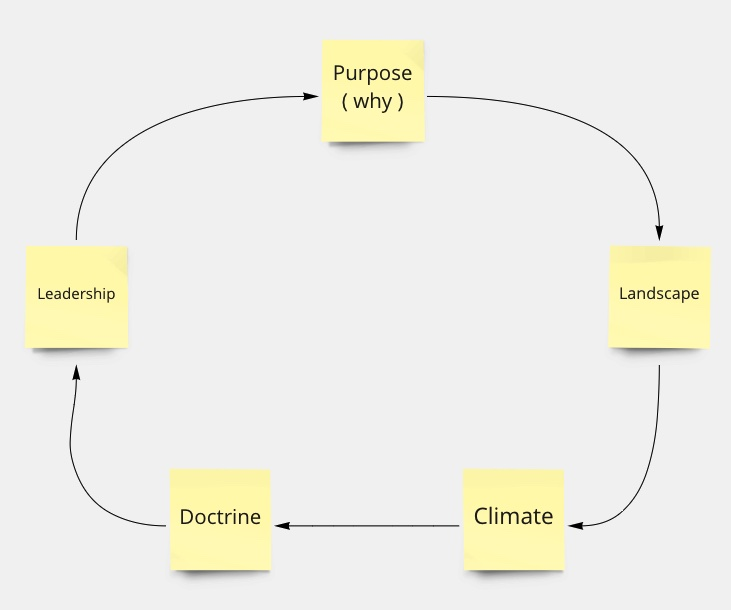

# Wardley mapping
Wardley mapping is a strategic mapping method invented by Simon Wardley.

It's a strategic tool for mapping your capabilities and their dependencies for making more informed decisions.

One of the key thoughts behind Wardley mapping,  is that every capability evolves through competition.
It starts from Genesis,  through Custom and Product till a capability is an Evolution.
An example for this is electricity, that started as an experiment,  after which every company had its own mean of generating electricity,  which evolved to a couple of competing standards,  till the comodity it is today.

Another trait of Wardley mapping is the fact that patterns can be discovered.
This allows for a reusable library of patterns and principles that can be used universally.

# How
Interview key stakeholders in the process,  and map the capabilities together.
Use the Wardley Mapping Canvas as a guide during the process.

## Purpose

The why of the excercise.
Sets the scope of what we are doing,  and the motivations behind it.

[Purpose](https://learnwardleymapping.com/purpose/)

## Landscape

A visual representation of the the problem,  with the capabilities and their dependencies.

Each capability is positioned depending on their visibility for the user,  and their stage in the evolution.

> To make a map:
> 
> - Identify the Users being served
> - Identify the Needs to be met (think of these as top-level Capabilities)
> - Identify the Capabilities needed to successfully meet those needs
> - Determine the stage of Evolution for each Capability by evaluating its characteristics (if it’s difficult to decide, try breaking the Capability down into multiple, smaller Capabilities)
> - Draw the complete value chain — User at the top, Needs and Capabilities underneath, with dependency relationships included and Capabilities placed in Stages I, II, III, or IV of Evolution

[Landscape](https://learnwardleymapping.com/landscape/)

## Climate

The external forces acting on the landscape.

i.e.:

- Everything Evolves Through Supply and Demand Competition
- Characteristics Change as Capabilities Evolve

Table of climatic patterns: [here](https://learnwardleymapping.com/climate/)

## Doctrine

After establishing the landscape and the forces that influence it,  the next step is to act upon it.
In doctrine you influence your people to influence the landscape.

This happens in 4 phases:
- Stop Self-Destructive Behaviour
- Become More Context Aware
- Better For Less
- Continuously Evolving

More details: [here](https://learnwardleymapping.com/doctrine/)

## Leadership

With all the previous steps you can now take an informed decision what strategy is appropriate.

# What
Start with the scope of the map.
After that determine the purpose of the excercise.

Next step is to list the different users of the process,  and their needs.

When the users and their needs are known,  create a value chain for the capabilities that support the user needs.

The last step is then to map the value chain you created on the evolution axis.

More information: 

[Crossing the stream by feeling the stones](https://www.youtube.com/watch?v=2IW9L1uNMCs&t=1107s)
[Learn wardley mapping](https://learnwardleymapping.com)